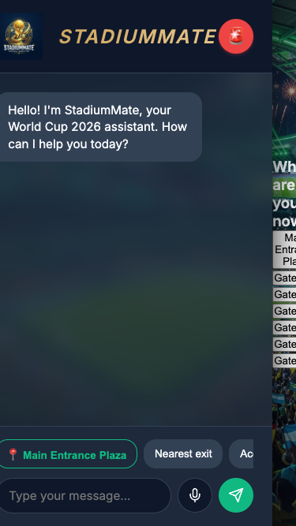
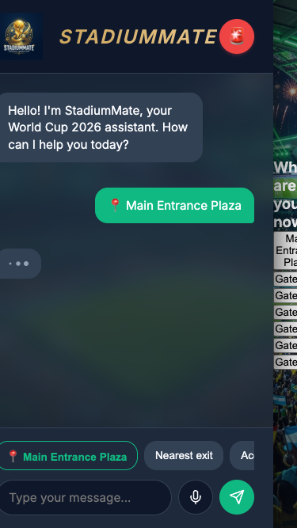
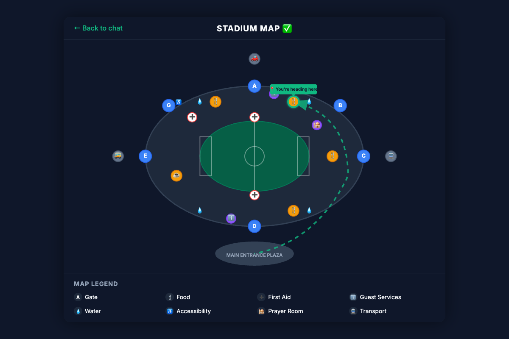

# StadiumMate

**A multilingual AI stadium assistant for FIFA World Cup 2026, built for Google PromptWars with Google Antigravity.**

StadiumMate is a GenAI-enabled web application designed to enhance the stadium experience for fans. Leveraging the Gemini API, it acts as a smart, multilingual assistant. Fans can ask questions via text or voice in their native language about gates, food, and transportation, and StadiumMate instantly provides accurate answers grounded in real stadium data.

## Features
- **Any-language text & voice chat:** Communicate seamlessly in your native language with voice transcription and speech synthesis.
- **Grounded answers:** Information is backed by accurate, structured stadium data.
- **Nearest-facility resolution:** Automatically calculates and guides you to the closest food, water, or first aid station based on your current location.
- **Interactive stadium map:** Visualizes precise, non-crossing walking routes through the stadium's concourse.
- **Google Maps directions:** Provides one-tap external transit navigation for buses, trains, and rideshares.
- **Location-aware "I'm near" picker:** An intuitive bottom sheet that lets users set their current location to get relevant, contextual answers.

## Tech Stack
- **Frontend:** Vanilla HTML, CSS, JavaScript
- **Backend:** Gemini API via Vercel serverless proxy
- **Browser APIs:** Web Speech API (speech synthesis) and MediaRecorder (voice capture)

## Architecture
> **Security First:** The Gemini API key is stored securely as a Vercel environment variable and is never exposed in the client code. All API requests run through a secure `/api/gemini` proxy route.

## How to Run

### Live Version
Visit the live URL to experience the app instantly. Best experienced in **Chrome**!

### Local Development
1. Clone the repository.
2. Ensure you have the [Vercel CLI](https://vercel.com/docs/cli) installed (`npm i -g vercel`).
3. Create a `.env` file in the project root containing your Gemini API key:
   ```env
   GEMINI_API_KEY="your_api_key_here"
   ```
4. Run the local dev server:
   ```bash
   vercel dev
   ```

## Screenshots

*Home Screen*


*Location-aware "I'm near" picker*


*Interactive Map & Walking Routes*

---
*Best experienced in Chrome.*
